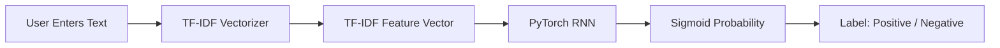

# Sentiment Analysis (RNN + TF-IDF)

A Django web app that loads a trained PyTorch RNN model to predict sentiment (positive/negative) from user-entered text. The current pipeline uses TF-IDF vectorization, then feeds the vector into an RNN and outputs a probability via `sigmoid`.

This repo includes:
- `SentimentAnalysis.ipynb` for training
- `best_rnn_weights.pth` for the trained model weights
- `tfidf_vectorizer.pkl` for the fitted TF-IDF vectorizer
- A Django app with an HTML form for predictions

## Flow Diagram



## Project Structure

```
.
├── SentimentAnalysis.ipynb
├── best_rnn_weights.pth
├── tfidf_vectorizer.pkl
├── manage.py
├── predictor/
│   ├── templates/predictor/index.html
│   ├── urls.py
│   └── views.py
└── sentiment_site/
    ├── settings.py
    └── urls.py
```

## Setup

1. Create and activate a virtual environment (optional but recommended).
2. Install dependencies:

```bash
python -m pip install django torch scikit-learn pandas numpy
```

## Run the Web App

```bash
python manage.py runserver
```

Then open:

```
http://127.0.0.1:8000/
```

## Training (Notebook)

In `SentimentAnalysis.ipynb`:

1. Fit the TF-IDF vectorizer:
   ```python
   from sklearn.feature_extraction.text import TfidfVectorizer
   tf = TfidfVectorizer(max_features=5000)
   x = tf.fit_transform(df["review"])
   ```
2. Save the vectorizer:
   ```python
   import pickle
   with open("tfidf_vectorizer.pkl", "wb") as f:
       pickle.dump(tf, f)
   ```
3. Train the RNN and save the best weights:
   ```python
   torch.save(model.state_dict(), "best_rnn_weights.pth")
   ```

## Notes on Model Choice

The current setup uses **TF-IDF + RNN**. TF-IDF is a bag-of-words method and **does not preserve word order**, so the RNN cannot exploit sequential information. This can limit accuracy.

If you want higher accuracy, consider either:
- **TF-IDF + Linear Model** (Logistic Regression / Linear SVM), or
- **True RNN Pipeline** (Tokenizer + Embedding + sequences).

## Troubleshooting

- If Django fails to start, ensure all dependencies are installed in the active environment.
- If predictions fail, make sure `best_rnn_weights.pth` and `tfidf_vectorizer.pkl` exist in the project root.

## License

Add a license if you plan to publish this project.
